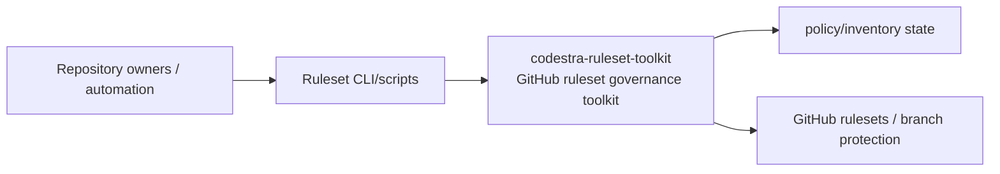
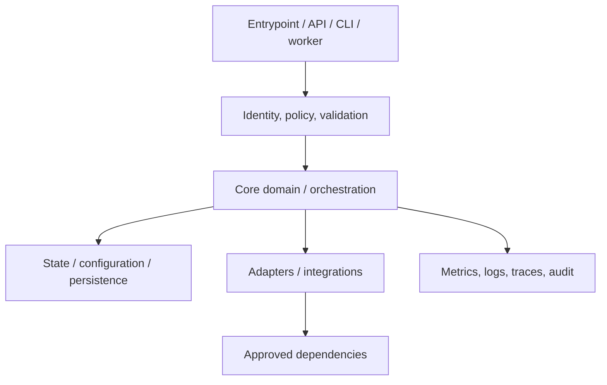
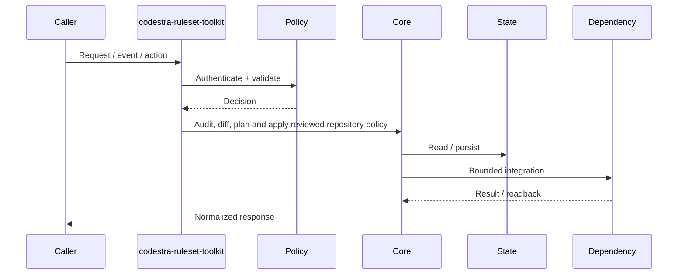
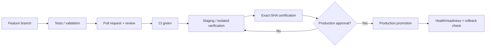
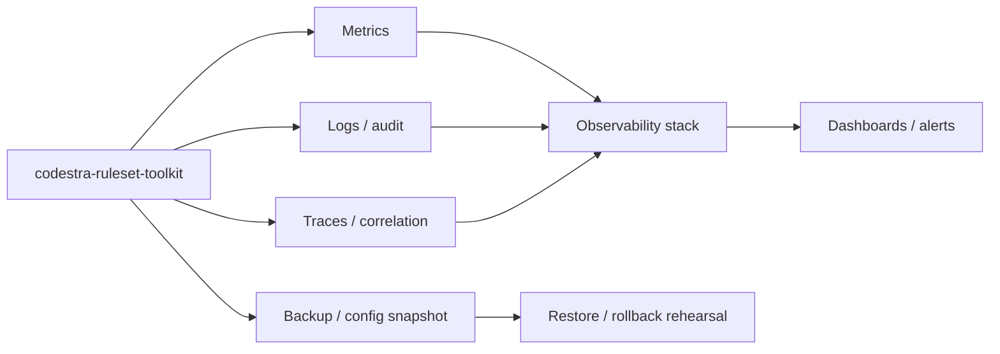

# codestra-ruleset-toolkit — Architecture Charts

> Repository: `appolon1908/codestra-ruleset-toolkit`  
> Baseline branch: `main`  
> Repository-local visual architecture. Keep these diagrams aligned with source, contracts and deployment.

## 1. System context

## 2. Internal component architecture

## 3. Critical flow

## 4. Deployment and promotion

## 5. Observability and recovery

## Ownership notes
- **Role:** GitHub ruleset governance toolkit
- **Primary boundary:** Ruleset CLI/scripts
- **State/config:** policy/inventory state
- **Dependencies/consumers:** GitHub rulesets / branch protection
- Cross-repository effects must use reviewed contracts; production effects remain separately gated.
